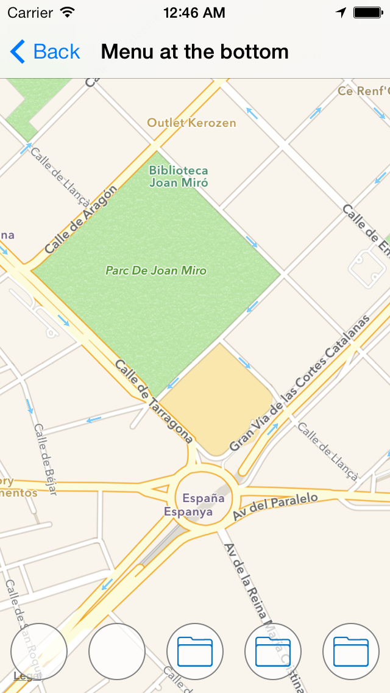
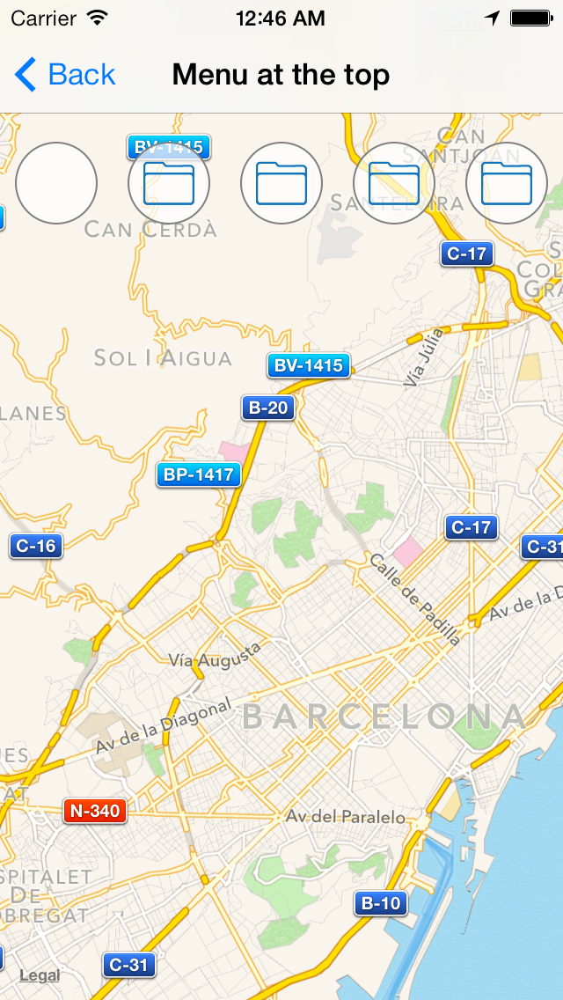

Overview
==============

&nbsp;&nbsp;

A couple of UIView subclasses that allows you to include an animated menu in your own iOS applications.

Basically, the library is composed by a couple of UIView subclasses: LCAnimatedMenu and LCMenuItem. LCAnimatedMenu acts as a container for LCMenuItem objects (we'll call them items).  You can add as many items as you want, but only five items will be displayed on screen. Since, all the items are added to a scroll view, you can scroll the menu to see the rest of the items previously added. The LCAnimatedMenu class is in charge of animating the entrance of all the items.

CocoaPods
==============

Add this line to your podfile:

```ruby
pod 'LCAnimatedMenu', '1.0.0'
```

Properties
==============

### For LCAnimatedMenu

`containerView`: This is the most important property. You will not see anything if you don't set it. You use this property to tell to LCAnimatedMenu which is its superview (Usually `self.view`). That's it.

`items`: It is useful to pass an array containing LCMenuItem objects to be displayed in the menu view. Only pass objects members of the LCMenuIten class, if you don't do it the class will raise an exception at runtime.

`animationDuration`: Determines in seconds how fast the items are displayed on screen. By default 1 second.

`position`: A property of type `LCAnimatedMenuPosition` used to tell to the class where to show the menu: `LCAnimatedMenuPositionBottom` at the bottom and `LCAnimatedMenuPositionTop` at the top. by default the menu is displayed at the bottom.

`showBelowTopBars`: Only works with the menu at the top position. It is an offset that adds some pixels (64.0 exactly) to the menu view to avoid overlap with the top bars (navigation bar and status bar).

`delegate`: It sets a delegate object for the `LCAnimatedMenuDelegate` protocol.


### For LCMenuItem

`borderColor`: By default, the items are displayed with an appearance, that is a rounded view. This rounded view has a border and this property sets a color for it. By default is `[UIColor grayColor]`.

`lineWidth`: It is the width for the border. By default 1.0.

`innerColor`: As I've mentioned previously, that rounded view has an inner circle. This property sets a color for that circle. By default is `[UIColor colorWithWhite:1.0f alpha:0.7f]`.

`actionBlock`: Under the hood, each item sends a message to its target (itself) when they are pressed, same way as UIButton do, but, because I prefer blocks, I decided to execute a block based action each time any button is pressed. If you set this property, you don't have to worry about button indexes neither implement delegate methods.

> Default configuration look very well in iOS 7 apps.

Initialization methods
==============

There are few methods to create both objects. For **LCMenuItem** there are two:

```objective-c
- (id)initWithImage:(UIImage *)image;
- (id)initWithImage:(UIImage *)image withActionBlock:(ActionBlock)actionBlock;
```

The first initializes an item with an image and the second initializes an item with an image and an action block. The image can cover all the button view and to be of any size. The layer mask, clips the image (assigned to the image property of a UIButton object) to the item bounds and the internal behavior resizes the button to a `50x50` size.

You can initialize an item without an image using the `initWithFrame:` method.

For the **LCAnimatedMenu** class you have only one method:

```objective-c
- (id)initWithItems:(NSArray *)items;
```

This method initializes an LCAnimatedMenu object with an array of items (LCMenuItem objects).

How to put it in my code?
==============

It's easy. Follow these few steps:

**1. Importing classes:** Import both clases in your `.m` file (Unless your are implementing the protocol methods):

```objective-c
#import "LCAnimatedMenu.h"
#import "LCMenuItem.h"
```

**2. Creating items:** In the method `viewWillAppear:`, create as much items as you need. You can initialize an item in many ways, I'll show you two. First, passing the actionBlock property with the inicialization method as an argument:

```objective-c
LCMenuItem *item1 = [[LCMenuItem alloc] initWithImage:[UIImage imageNamed:@"item.png"]
                                      withActionBlock:^(void)
                         {
                             // do something cool
                         }];
```

Or as I prefer, setting the actionBlock property after initialization:

```objective-c
LCMenuItem *item1 = [[LCMenuItem alloc] initWithImage:[UIImage imageNamed:@"item.png"]];
item1.actionBlock = ^(void)
{
    // do something cool again
};
```

Both of them do the same work. I leave that decision to you. However, if you don't want to initialize with an image, you can use the `initWithFrame:` method:

```objective-c
LCMenuItem *item1 = [[LCMenuItem alloc] initWithFrame:CGRectZero];
```

**3. Initializing the menu:** Initialize the LCAnimatedMenu object passing in the argument the items previously created:

```objective-c
LCAnimatedMenu *menu = [[LCAnimatedMenu alloc] initWithItems:@[item1, item2, item3, item4, item5, item6]];
```

If you want to the class to be the delegate of the `LCAnimatedMenuDelegate` protocol, you have to set the `delegate` property to your view controller (and of course, make the class conforms to the protocol):

```objective-c
menu.delegate = self;
```

If you want that the menu to be displayed at the top of the screen, set the `position` property:

```objective-c
menu.position = LCAnimatedMenuPositionTop;
```

Furthermore, if your screen has an status bar and a navigation bar, and you don't want the menu to be displayed under those bars, you need to set the `showBelowTopBars` property to `YES`:

```objective-c
menu.showBelowTopBars = YES;
```

The last and more important thing to do is set the containerView property. It is usually `self.view` if you want to show the menu in a normal screen managed by an UIViewController subclass, but you can use any custom view that you want:

```objective-c
menu.containerView = self.view;
```

Protocol methods
==============

This little library has a protocol methods, which warns you when the menu is about to be displayed, has been displayed and is about to be hidden respectively:

```objective-c
- (void)willDisplayAnimatedMenu:(LCAnimatedMenu *)animatedMenu;
- (void)didDisplayAnimatedMenu:(LCAnimatedMenu *)animatedMenu;
- (void)willHideAnimatedMenu:(LCAnimatedMenu *)animatedMenu;
```

You can override these methods in your own classes to perform actions in the mentioned states of the animation.

License
==============

The MIT License (MIT)
 
Copyright (c) 2013 Luis Cardenas. All rights reserved.
 
Permission is hereby granted, free of charge, to any person obtaining a copy
of this software and associated documentation files (the "Software"), to deal
in the Software without restriction, including without limitation the rights
to use, copy, modify, merge, publish, distribute, sublicense, and/or sell
copies of the Software, and to permit persons to whom the Software is
furnished to do so, subject to the following conditions:
 
The above copyright notice and this permission notice shall be included in
all copies or substantial portions of the Software.
 
THE SOFTWARE IS PROVIDED "AS IS", WITHOUT WARRANTY OF ANY KIND, EXPRESS OR
IMPLIED, INCLUDING BUT NOT LIMITED TO THE WARRANTIES OF MERCHANTABILITY,
FITNESS FOR A PARTICULAR PURPOSE AND NONINFRINGEMENT. IN NO EVENT SHALL THE
AUTHORS OR COPYRIGHT HOLDERS BE LIABLE FOR ANY CLAIM, DAMAGES OR OTHER
LIABILITY, WHETHER IN AN ACTION OF CONTRACT, TORT OR OTHERWISE, ARISING FROM,
OUT OF OR IN CONNECTION WITH THE SOFTWARE OR THE USE OR OTHER DEALINGS IN
THE SOFTWARE.

